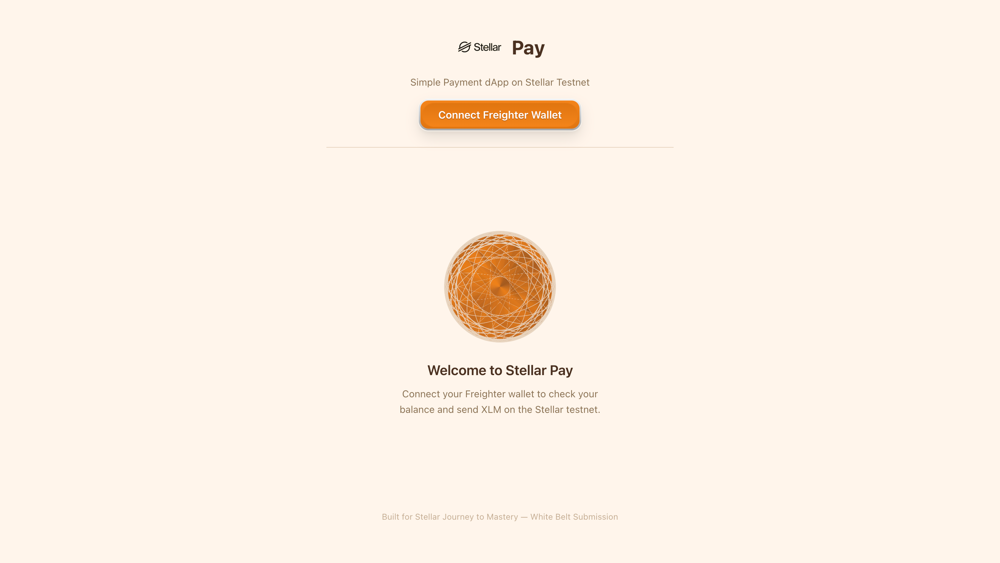
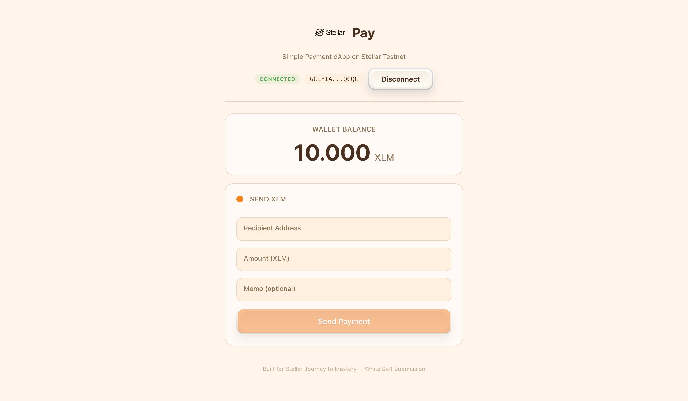
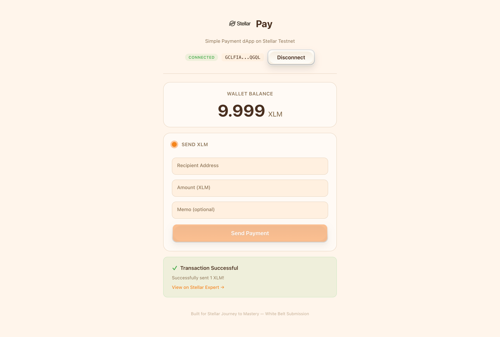
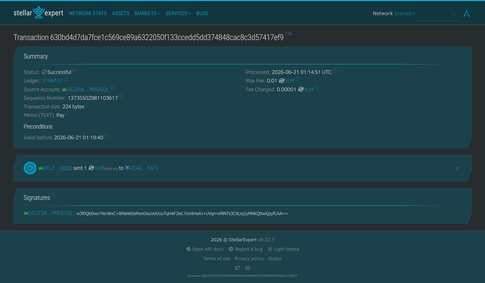

# Stellar Pay

A clean, production-ready payment dApp built on the **Stellar Testnet** for the Stellar Journey to Mastery – White Belt submission.

## Description

Stellar Pay is a simple, elegant payment dApp that demonstrates core Stellar blockchain interactions:
- Connect / disconnect **Freighter wallet**
- Fetch and display real-time **XLM balance**
- Send **XLM** payments with optional memo
- Real-time transaction feedback with Stellar Expert explorer links

## Tech Stack

| Layer | Technology |
|-------|-----------|
| Framework | React 19 + TypeScript |
| Build Tool | Vite |
| Wallet | Freighter Browser Extension |
| Network | Stellar Testnet |
| SDKs | `@stellar/freighter-api` v6, `stellar-sdk` v13 |

## Setup Instructions

### Prerequisites

1. **Node.js** v18 or later
2. **Freighter Wallet** browser extension ([install here](https://www.freighter.app/))
3. A funded Stellar **Testnet** account (use [Stellar Laboratory](https://laboratory.stellar.org/#account-creator?network=test) to create and fund)

### Quick Start

```bash
npm install
npm run dev
```

The app runs on `http://localhost:5173`.

### Build

```bash
npm run build
npm run preview
```

## How to Use

1. Open the app and click **"Connect Freighter Wallet"**
2. Approve the connection in Freighter
3. Your **XLM balance** displays automatically
4. Fill in recipient address, amount, and optional memo
5. Click **"Send Payment"**
6. Approve the transaction in Freighter
7. View transaction result and link to Stellar Expert

## Screenshots

### Wallet Connected State


### Balance Displayed


### Successful Testnet Transaction


### Transaction Result Shown


## Project Structure

```
stellar-white-belt/
├── index.html
├── package.json
├── tsconfig.json
├── vite.config.ts
└── src/
    ├── main.tsx
    ├── App.tsx
    ├── index.css
    └── vite-env.d.ts
```

## Author

Built for **Stellar Journey to Mastery** – White Belt Level 1 Submission.
